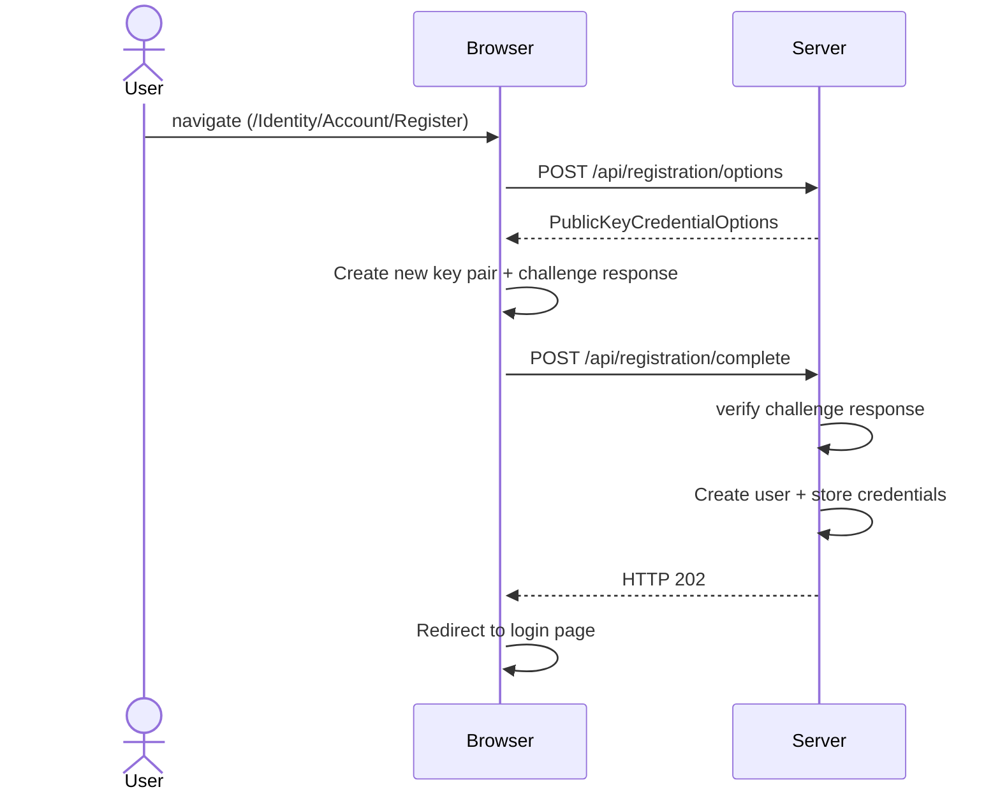
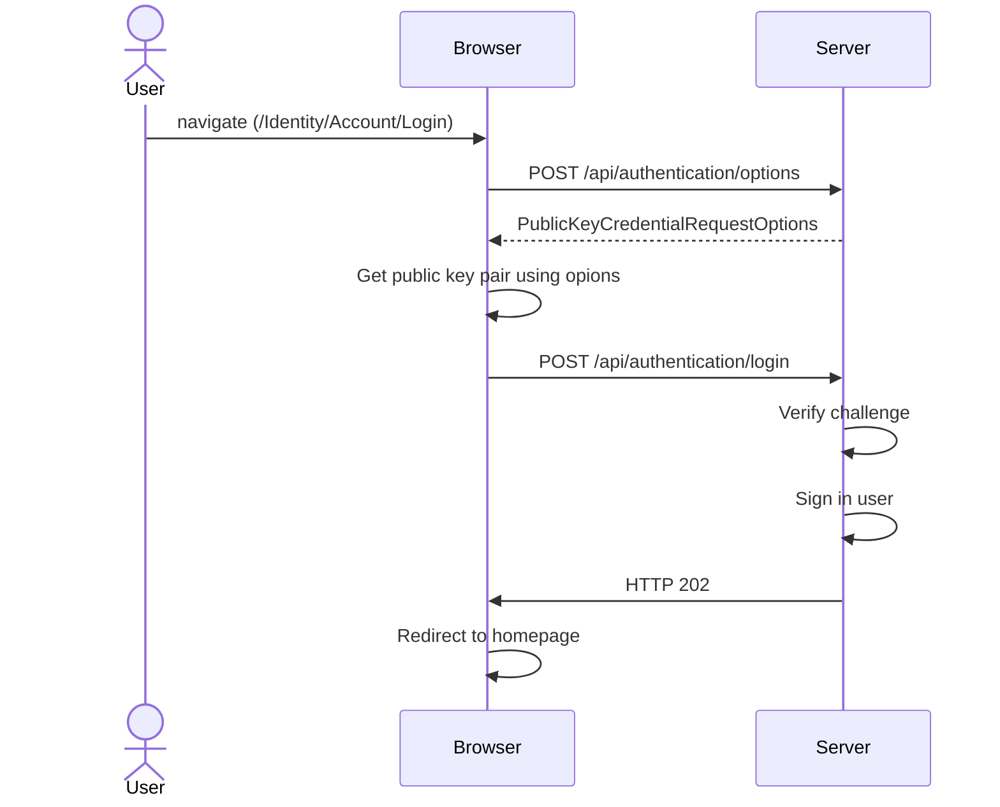

# WebAuthn sample

This sample demonstrates how to integrate WebAuthn with FIDO2 keys into ASP.NET Core. Please read the rest of this README 
to get a full picture of what's in the sample and how the various components work together.

## System requirements

* .NET SDK 6.0
* Latest LTS release Node 

## Getting started

You can run this sample as a docker container using the following steps:

* `git clone https://github.com/wmeints/webauthn-sample/`

After cloning the repository, create a file `.env` with the following content:

```text
DB_PASSWORD=SomethingStr0ng!
```

You can choose any password you like. Once you have the password set, perform the following steps from the root of the project directory:

* `docker-compose up -d`
* `cd src/WebAuthnSample`
* `dotnet user-secrets set "ConnectionStrings:DefaultDatabase" "data source=127.0.0.1;initial catalog=webauthn;user id=sa;password=<your-password>"`

Make sure the password in the last step matches the password that was stored in the `.env` file. Now execute the following
command from `src/WebAuthnSample` directory:

* `dotnet run`

Open the browser to `https://localhost:7140` follow the on-screen instructions.

## Documentation

### Project structure

The project is made out of two parts:

* `src/WebAuthnSample` - Contains the server-side application.
* `src/WebAuthnSample/Client` - Contains the client-side scripts.

The server-side components are written in ASP.NET Core 6.
For the client-side components I've used webpack with React. 

#### The client-side scripts

The client-side scripts use React. I've made a setup where each page gets its own dedicated script.

* `src/WebAuthnSample/Pages/Login.cshtml` - Uses `src/WebAuthnSample/wwwroot/js/authentication.js`.
* `src/WebAuthnSample/Pages/Register.cshtml` - Uses `src/WebAuthnSample/wwwroot/js/registration.js`.

The registration script is compiled from `src/WebAuthnSample/Client/registration/index.tsx` and related files.
The authentication script is compiled from `src/WebAuthnSample/Client/authentication/index.tsx` and related files.

For performance reasons, I've split the shared scripts into `src/WebAuthnSample/wwwroot/shared.js`. This script
is contains react, react-dom, and the sources from `src/WebAuthnSample/Client/shared/`.

#### The server-side components

The server-side part follows this layout:

* `src/WebAuthnSample/Controllers` - Contains two API controllers for registration and authentication.
* `src/WebAuthnSample/Services` - Contains business logic to implement the registration and authentication.
* `src/WebAuthnSample/Models` - Contains models used in the application.
* `src/WebAuthnSample/Data` - Contains persistence logic for the application.
* `src/WebAuthnSample/Forms` - Contains the forms used in the controllers. 
* `src/WebAuthnSample/Pages` - Contains the pages for the application.

### How does WebAuthn work?

WebAuthn is a standard for authenticating users using public key cryptography. You can choose to use a platform
key or a cross-platform key. The former is usually a trusted platform module in your laptop or desktop. The latter
is a USB key or a mobile phone. 

Using WebAuthn, we can move away from passwords completely. But you can use it also as a second factor next to a
traditional password. In this example, we're using WebAuthn to replace passwords with a public key credential.

#### Registering a user using WebAuthn

To set up authentication with a public key credential, we need to register a new account first.
The following flow demonstrates how this is done:



1. When the user navigates to [the registration page][REGISTRATION_URL], we'll ask the user to fill out the registration
   form. After filling out the form, they click on *Register* to start the registration process.
2. Next, we need to get [a challenge][CHALLENGE_URL] from the server. This challenge includes a set of options under
   which conditions the server accepts a new public key for registration. 
3. After that, the browser [generates a new key pair][KEYPAIR_URL] and answers the challenge. This ensures that the server knows who's
   registering and we're not some rogue client to break into the website. Each challenge can be used once to register a
   new key pair.
4. The browser posts [the response to the challenge][COMPLETE_REGISTRATION_URL] to the server to complete the registration. The server needs to
   [verify the challenge][VERIFY_REGISTRATION_URL] response against the challenge it generated earlier. We stored the challenge options in the
   HTTP session earlier. You can choose to store this elsewhere on the server as necessary.
5. When the challenge is verified and found to be correct, the server sends a HTTP 202 response back to the client.
6. The browser will [redirect the user][REGISTRATION_REDIRECT_URL] to the login page.

The ceremony to verify a public key pair during the registration process is quite extensive. If you're interested in
the full spec, I can recommend to read [the WebAuthn spec](https://w3c.github.io/webauthn/#sctn-registering-a-new-credential).

After we've registered the user, we can work on the login phase.

#### Authenticating a user using WebAuthn

The following flow demonstrates how to authenticate a user using Webauthn:



1. When the user navigates to [the login page][LOGIN_URL], fills out the login form, and clicks *Login* the login process is started.
2. The browser will request an [authentication challenge][LOGIN_CHALLENGE_URL] from the server that includes all registered public keys for its
   account. 
3. The server returns an authentication challenge that includes all the registered public keys for the user's account.
4. The browser asks the user [to insert the USB key][LOGIN_CREDENTIAL_URL] they like to login with. If the key matches one of the registered
   public keys, the browser asks the user to touch their key to confirm the login.
5. The browser signs the authentication challenge and [sends this response][LOGIN_RESPONSE_URL] to the server.
6. The server [verifies the challenge][VERIFY_LOGIN_URL], and signs in the user.
7. The browser receives a HTTP 202, and redirects the user to the home page.

If you're interested in the ceremony to verify a login challenge, you can find a description [in the WebAuthn spec](https://w3c.github.io/webauthn/#sctn-verifying-assertion).

[REGISTRATION_URL]: https://github.com/wmeints/webauthn-sample/blob/d6683db6bf4ffb17b3b0784d2f46ed24e5398ac4/src/WebAuthnSample/Client/registration/RegistrationForm.tsx#L11
[CHALLENGE_URL]: https://github.com/wmeints/webauthn-sample/blob/d6683db6bf4ffb17b3b0784d2f46ed24e5398ac4/src/WebAuthnSample/Controllers/RegistrationController.cs#L24
[KEYPAIR_URL]: https://github.com/wmeints/webauthn-sample/blob/d6683db6bf4ffb17b3b0784d2f46ed24e5398ac4/src/WebAuthnSample/Client/registration/RegistrationForm.tsx#L49
[COMPLETE_REGISTRATION_URL]: https://github.com/wmeints/webauthn-sample/blob/d6683db6bf4ffb17b3b0784d2f46ed24e5398ac4/src/WebAuthnSample/Client/registration/api.ts#L53
[VERIFY_REGISTRATION_URL]: https://github.com/wmeints/webauthn-sample/blob/d6683db6bf4ffb17b3b0784d2f46ed24e5398ac4/src/WebAuthnSample/Controllers/RegistrationController.cs#L46
[REGISTRATION_REDIRECT_URL]: https://github.com/wmeints/webauthn-sample/blob/d6683db6bf4ffb17b3b0784d2f46ed24e5398ac4/src/WebAuthnSample/Client/registration/RegistrationForm.tsx#L64
[LOGIN_URL]: https://github.com/wmeints/webauthn-sample/blob/d6683db6bf4ffb17b3b0784d2f46ed24e5398ac4/src/WebAuthnSample/Client/authentication/LoginForm.tsx#L8
[LOGIN_CHALLENGE_URL]: https://github.com/wmeints/webauthn-sample/blob/d6683db6bf4ffb17b3b0784d2f46ed24e5398ac4/src/WebAuthnSample/Controllers/AuthenticationController.cs#L23
[LOGIN_CREDENTIAL_URL]: https://github.com/wmeints/webauthn-sample/blob/d6683db6bf4ffb17b3b0784d2f46ed24e5398ac4/src/WebAuthnSample/Client/authentication/LoginForm.tsx#L37
[LOGIN_RESPONSE_URL]: https://github.com/wmeints/webauthn-sample/blob/d6683db6bf4ffb17b3b0784d2f46ed24e5398ac4/src/WebAuthnSample/Client/authentication/api.ts#L43
[VERIFY_LOGIN_URL]: https://github.com/wmeints/webauthn-sample/blob/d6683db6bf4ffb17b3b0784d2f46ed24e5398ac4/src/WebAuthnSample/Controllers/AuthenticationController.cs#L44